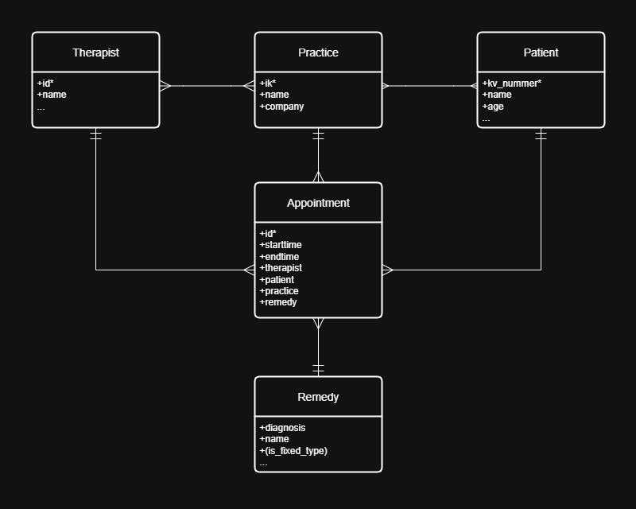
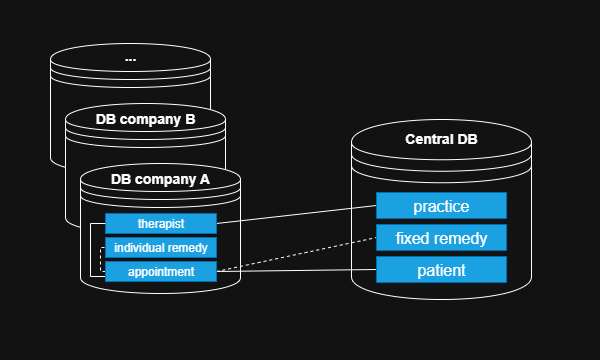

# Appointment booking for patients in distributed service architecture  
Appointments can be retrieved on any client from a GRPC backend. The data is distributed across dedicated databases per customer as well as a central database and must be retrieved and referenced via the backend(s). Note: If I use terms somewhere for entity types, endpoints, etc., these are only placeholders. How you ultimately name things and which naming conventions you follow is of course up to you.

## Data:
This model represents, in a very strongly simplified way, the core entities of our business model. Please use these entities with the specified attributes for the task. You can of course come up with additional attributes (optional). For the creation of mock data, it is not important whether the structure is professionally correct. Meaning: whether the health insurance number or IK corresponds to the actual structure doesn't matter. Also whether the diagnoses for remedies actually exist, doesn't matter.

### Entitytypes:  
- Practice: Multiple practices can be assigned to a company. The company does not necessarily have to be modeled as an entity in the resulting data structure, as it is isolated in the form of its own database (more on that later). Practice has, with the institution code (IK), a natural, globally unique key.  
- Therapist: Multiple therapists can work in a practice, and one therapist can work in multiple practices. For simplicity, the restriction applies that a therapist cannot work in practices assigned to different companies.  
- Patient: A practice has multiple patients, a patient can be assigned to multiple practices. Patients have a globally unique, natural key with the kv_number.  
- Remedy: These are divided into fixed remedies (defined by a legal remedy catalog) and individually created remedies. Individually created remedies can be added by the practices and are stored in the customer database. Fixed remedies are globally consistent and stored in the central database. They are identified by a diagnosis code. The attribute `is_fixed_type` is meant to indicate that a remedy is stored either in the customer database or the central database and therefore does not need to be modeled explicitly again.  
- Appointment: An appointment is always assigned exactly one therapist, one patient, and one remedy. Remedy, therapist, and patient, however, can be assigned to multiple appointments. Appointments are stored in the customer database but must reliably reference either the fixed remedy in the central database or the individual remedy in the customer database.

### Distribution
The second model represents, in simplified form, the relationship between the physical data structures:  

- each company (it's enough to use two for the task) has its "own" database, which can be uniquely assigned to it (for example, via the name).  
- Some of the entities should only be represented in this respective customer database (therapist, individual remedy, appointment).  
- Other globally identifiable entities, which are referenced by multiple customer databases, are stored in a central database (patient, practice, fixed remedy).  
- The challenge is to ensure the most reliable referencing possible between the databases.

### DBMS
- for the customer databases, any SQL-capable DBMS can be used.
- for the central database, either an SQL or a NoSQL DB can be used

## Backend(s)
- it is sufficient to create a single GRPC backend which can directly access all databases and provide the endpoints
- optional: customer databases and the central database have their own dedicated backend (i.e., classic microservice). A gateway provides the endpoints, handles request transformation, authentication, and aggregation, and calls the dedicated backends.
- the backend / backend projects are written in .NET
- optional: filters for the endpoints to retrieve certain subsets (appointments from–to, remedies by name, etc.)

### Auth
Authentication can be kept very simple (fixed API keys), but should cover the access levels below. Optional: auth via a more flexible mechanism such as JWT. 

| name     | auth required | resource access                                    | db access                |
| -------- | ------------- | -------------------------------------------------- | ------------------------ |
| public   | no            | fixed remedies                                     | central only             |
| global   | yes           | public + patient, practice                         | central only             |
| customer | yes           | global + therapist, individual remedy, appointment | own customer db, central |

### Endpoints
The following endpoints are available (function, authentication):
- retrieve fixed remedies | public
- retrieve practice data | global  
- retrieve patients in a practice | global  
- retrieve appointments of a patient for a practice | local  
- retrieve appointments of a therapist | local

## End-user client: 
You can choose what to provide client-side to test the data retrieval. This can be a terminal application, a web frontend, or even a shared workspace for Postman. What's important is that the corresponding configs for authentication and valid data structures are set up.

## Deployment
- at minimum, the following components must be provided: end-user client, GRPC service, databases
- GRPC backend(s) as Docker images, as well as a compose file that sets up all further dependencies (databases)
- the stack will be deployed on a server (you'll get credentials and IP from us — it's a Linux box with Debian)
- SSL is not necessary
